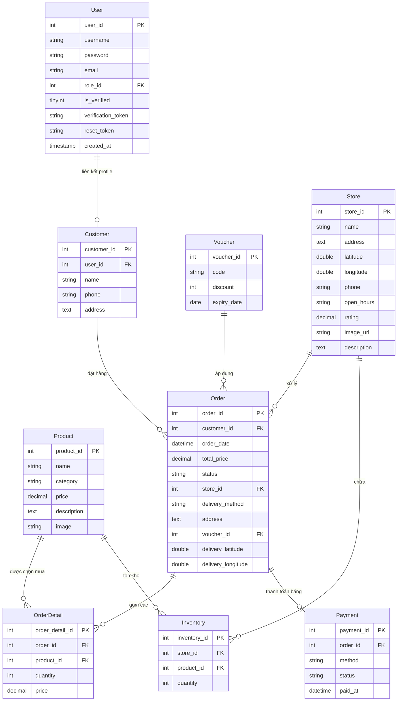
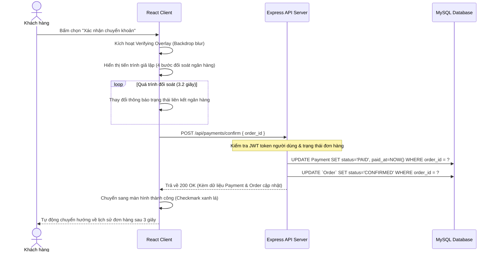

# BÁO CÁO ĐỒ ÁN TỐT NGHIỆP / BÁO CÁO MÔN HỌC

## ĐỀ TÀI: XÂY DỰNG HỆ THỐNG WEBSITE THƯƠNG MẠI ĐIỆN TỬ CỬA HÀNG BÁNH NGỌT SCARLETT CAKE SHOP TÍCH HỢP CỔNG THANH TOÁN VIETQR REALTIME

---

## LỜI MỞ ĐẦU

### 1. Lý do chọn đề tài
Trong kỷ nguyên số hóa và sự bùng nổ của thương mại điện tử (E-commerce), việc các doanh nghiệp bán lẻ và ngành thực phẩm - đồ uống (F&B) dịch chuyển mô hình kinh doanh lên nền tảng trực tuyến đã trở thành xu thế tất yếu. Ngành bánh ngọt là một thị trường ngách có tính cạnh tranh cao, đòi hỏi không chỉ chất lượng sản phẩm tốt mà còn cần trải nghiệm mua sắm trực tuyến mượt mà, định vị giao hàng nhanh chóng và thanh toán tiện lợi.

Phương thức thanh toán chuyển khoản qua mã QR ngân hàng (VietQR) đang chiếm lĩnh thị trường Việt Nam nhờ tính tiện dụng, nhanh chóng và không tốn phí giao dịch. Do đó, việc xây dựng một website thương mại điện tử chuyên nghiệp cho thương hiệu bánh ngọt cao cấp tích hợp cơ chế đối soát thanh toán chuyển khoản tự động thời gian thực (realtime) là vô cùng thực tiễn. Đề tài **"Xây dựng hệ thống website thương mại điện tử cửa hàng bánh ngọt Scarlett Cake Shop tích hợp cổng thanh toán VietQR Realtime"** được lựa chọn nhằm giải quyết các bài toán trên.

### 2. Mục tiêu đề tài
* Xây dựng ứng dụng web SPA (Single Page Application) tương tác cao, thiết kế sang trọng đồng nhất theo chủ đề thương hiệu Bordeaux Scarlett.
* Triển khai hệ thống xác thực tài khoản chặt chẽ qua Email (Nodemailer SMTP) ngăn ngừa spam.
* Thiết kế phân quyền người dùng đa lớp: Khách hàng (Customer), Nhân viên chi nhánh (Employee), Quản trị viên tối cao (Admin).
* Triển khai giải pháp thanh toán VietQR động tự động điền thông tin và giả lập luồng đối soát chuyển khoản ngân hàng thời gian thực.
* Tích hợp bản đồ trực tuyến giúp tìm kiếm chi nhánh gần nhất qua GPS và chỉ đường tự động.

---

## CHƯƠNG 1: CƠ SỞ LÝ THUYẾT & PHÂN TÍCH YÊU CẦU HỆ THỐNG

### 1.1. Công nghệ sử dụng
Hệ thống áp dụng mô hình kiến trúc Client-Server hiện đại, phân tách rõ ràng:

1. **Frontend (Client Layer)**:
   * **React.js (Vite)**: Thư viện Javascript xây dựng giao diện người dùng SPA hiệu năng cao.
   * **Context API**: Quản lý State toàn cục của ứng dụng (trạng thái đăng nhập, token, vai trò người dùng).
   * **React Router v7**: Điều hướng các tuyến đường trang tĩnh và trang động một cách tối ưu.
   * **Lucide React**: Bộ icon vector chất lượng cao đồng bộ giao diện.

2. **Backend (Server Layer)**:
   * **Node.js & Express.js**: Môi trường thực thi Javascript và framework xây dựng API RESTful gọn nhẹ, xử lý bất đồng bộ tốt.
   * **JSON Web Tokens (JWT)**: Cơ chế xác thực không lưu trạng thái (Stateless Authentication) giúp bảo mật các phiên làm việc của Client.
   * **Nodemailer**: Module hỗ trợ gửi thư điện tử kích hoạt tài khoản và OTP bảo mật qua SMTP Server của Google Gmail.

3. **Cơ sở dữ liệu & Cơ sở hạ tầng (Database & Infrastructure)**:
   * **MySQL**: Hệ quản trị cơ sở dữ liệu quan hệ mạnh mẽ, đảm bảo tính toàn vẹn dữ liệu.
   * **VietQR API (img.vietqr.io)**: Dịch vụ tạo mã QR tiêu chuẩn Napas247 động dựa trên số tài khoản, số tiền và nội dung chuyển khoản.
   * **Google Maps Embed API**: Tích hợp bản đồ định vị địa điểm chi nhánh.

---

### 1.2. Phân tích yêu cầu chức năng (Usecase Analysis)

Hệ thống phục vụ 3 tác nhân chính (Actors) với các ca sử dụng cụ thể:

```mermaid
rect Gold
    note right of Customer: Xem bánh, Giỏ hàng, Đặt đơn, Thanh toán VietQR, Xem lịch sử đơn
end
rect DarkRed
    note right of Employee: Xem đơn toàn hệ thống, Cập nhật trạng thái đơn, Chỉnh sửa sản phẩm
end
rect Grey
    note right of Admin: Thống kê Dashboard SVG, Quản lý CRUD (Sản phẩm, Voucher, Cửa hàng)
end
```

#### 1.2.1. Phân hệ Khách hàng (Customer)
* **Đăng ký tài khoản**: Nhập thông tin và nhận email chứa link kích hoạt tài khoản.
* **Đăng nhập / Đăng xuất**: Đăng nhập bằng tài khoản đã kích hoạt, lưu trữ JWT Token cục bộ.
* **Quên mật khẩu**: Nhập email nhận mã OTP xác thực và thiết lập lại mật khẩu mới.
* **Duyệt sản phẩm**: Xem danh sách bánh, xem chi tiết thành phần, giá cả của từng loại bánh.
* **Quản lý giỏ hàng**: Thêm bánh vào giỏ, điều chỉnh số lượng trực tiếp với hiệu ứng bay sản phẩm sinh động.
* **Đặt hàng & Áp mã Voucher**: Chọn chi nhánh gần nhất dựa trên khoảng cách định vị GPS, nhập mã giảm giá tính toán lại số tiền thực tế.
* **Thanh toán VietQR**: Xem mã QR tự sinh theo đơn hàng, bấm xác nhận giả lập chuyển khoản để cập nhật đơn hàng thành `CONFIRMED` realtime.
* **Lịch sử đơn hàng**: Theo dõi trạng thái đơn (Chờ xử lý, Đã xác nhận, Đang giao, Đã giao, Đã hủy) trực quan qua bảng màu.

#### 1.2.2. Phân hệ Nhân viên (Employee)
* **Quản lý sản phẩm**: Xem danh sách bánh chi tiết, cập nhật giá bánh, mô tả, ảnh bánh. (Nút xóa bánh bị vô hiệu hóa để đảm bảo an toàn dữ liệu).
* **Quản lý đơn hàng**: Xem toàn bộ danh sách đơn đặt hàng của hệ thống, lọc tìm theo mã đơn, cập nhật trạng thái đơn từ `PENDING` lên `CONFIRMED` -> `SHIPPING` -> `DELIVERED` hoặc `CANCELLED`.

#### 1.2.3. Phân hệ Quản trị viên (Admin)
* **Thống kê Dashboard**: Xem biểu đồ doanh thu 30 ngày dạng đồ họa trực quan (SVG), xem số liệu tổng hợp doanh thu, tổng số đơn, tổng khách hàng và danh sách top bánh bán chạy.
* **Quản lý sản phẩm**: Thực hiện đầy đủ quyền thêm, sửa, xóa bánh ngọt.
* **Quản lý Voucher**: Thêm mã giảm giá mới, cấu hình hạn dùng và phần trăm chiết khấu, xóa mã cũ.
* **Quản lý Cửa hàng**: Cập nhật thông tin chi nhánh, giờ mở cửa, số hotline và tọa độ bản đồ.

---

## CHƯƠNG 2: THIẾT KẾ HỆ THỐNG VÀ CƠ SỞ DỮ LIỆU

### 2.1. Sơ đồ thực thể quan hệ (ERD Diagram)

Hệ thống bao gồm các bảng dữ liệu chuẩn hóa, giảm thiểu tối đa hiện tượng dư thừa dữ liệu:



---

### 2.2. Thiết kế các luồng xử lý chính (Sequence Diagrams)

#### 2.2.1. Luồng Xác nhận Thanh toán Realtime (VietQR)
Đây là tính năng quan trọng nhất của đồ án, mô phỏng quá trình giao dịch với ngân hàng của khách hàng:



---

## CHƯƠNG 3: TRIỂN KHAI CHI TIẾT & GIAO DIỆN HỆ THỐNG

### 3.1. Thiết kế Giao diện Người dùng (UI/UX)
Giao diện được xây dựng bằng **Vanilla CSS** kết hợp cùng cấu trúc component linh hoạt của React. Tông màu Bordeaux Scarlett (`#6b1111`) được chọn làm màu chủ đạo của hệ thống, kết hợp với các điểm nhấn màu vàng cát cổ điển (`#b89a5b`) tạo cảm giác sang trọng của một tiệm bánh ngọt kiểu Pháp.

1. **Trang Checkout**:
   * Phân chia rõ ràng thành 2 phân khu: Cột nhập thông tin nhận hàng và Cột tóm tắt đơn hàng kèm mã giảm giá.
   * Bản đồ gợi ý cửa hàng gần nhất dựa vào vị trí thực tế của khách hàng thông qua Geolocation API.

2. **Trang Cổng thanh toán (Payment Gateway)**:
   * Phía trái: Chi tiết thông tin tài khoản ngân hàng của tiệm bánh (MB Bank, Số tài khoản, Chủ tài khoản, Số tiền, Nội dung chuyển khoản duy nhất `SCARLETT <order_id>`) kèm theo các nút copy nhanh bằng một chạm tiện lợi.
   * Phía phải: Mã QR VietQR động kích thước lớn, dễ quét.
   * Bộ đếm ngược 10 phút tạo hiệu ứng đếm ngược thời gian giao dịch thực tế.

3. **Trang Lịch sử đơn hàng (My Orders)**:
   * Các mã đơn hàng hiển thị dưới dạng các thẻ Badge nổi bật có nền đỏ Bordeaux và chữ trắng ngà giúp định vị từng đơn hàng dễ dàng.
   * Trạng thái đơn hàng phân chia màu sắc trực quan (Lớp màu dịu như xanh lục cho *Đã xác nhận*, xanh lam cho *Đang giao*, vàng cam cho *Chờ xử lý*...).

4. **Trang Admin Dashboard**:
   * Biểu đồ doanh thu 30 ngày vẽ trực tiếp bằng các thẻ `<svg>` và đường dẫn `<path>` mượt mà, hỗ trợ giao diện responsive khi xem trên điện thoại.

---

### 3.2. Triển khai các giải pháp Kỹ thuật tối ưu

#### 3.2.1. Google Maps tích hợp miễn phí không cần API Key
Để tránh việc đăng ký thẻ tín dụng và thanh toán phí cho dịch vụ Google Cloud Platform, hệ thống sử dụng Iframe Google Maps Search Embed:
```javascript
src={`https://maps.google.com/maps?q=${store.latitude && store.longitude ? `${store.latitude},${store.longitude}` : encodeURIComponent(store.address)}&hl=vi&z=16&output=embed`}
```
Giải pháp này giải quyết được vấn đề hiển thị bản đồ trực quan, hỗ trợ zoom và tương tác đầy đủ mà hoàn toàn không mất chi phí.

#### 3.2.2. Xử lý lỗi trỏ đường đi Bản đồ (Directions Fallback)
Khi người dùng bấm vào nút "Hướng dẫn đường đi", hệ thống kiểm tra nếu tọa độ GPS của cửa hàng bị trống (`null` hoặc `0`), nó sẽ tự động chuyển đổi sang liên kết tìm kiếm đường đi bằng địa chỉ chữ của cửa hàng:
```javascript
const directionsUrl = store.latitude && store.longitude
  ? `https://www.google.com/maps/dir/?api=1&destination=${store.latitude},${store.longitude}`
  : `https://www.google.com/maps/dir/?api=1&destination=${encodeURIComponent(store.address)}`;
```
Điều này loại bỏ hoàn toàn khả năng người dùng bị chuyển hướng tới một điểm tọa độ lỗi (`null,null`) trên Google Maps.

---

## CHƯƠNG 4: THỬ NGHIỆM & ĐÁNH GIÁ KẾT QUẢ

### 4.1. Kế hoạch Thử nghiệm (Test Plan)
Hệ thống kiểm thử tự động (Integration Testing) được xây dựng bằng cách gọi trực tiếp API thông qua thư viện `node-fetch`, chạy độc lập với trình duyệt để kiểm tra toàn bộ luồng nghiệp vụ.

1. **Test Case 1 (Luồng Đăng ký & Kích hoạt Email)**: Đăng ký tài khoản -> Lấy verification token trực tiếp từ MySQL -> Gọi API kích hoạt -> Kiểm tra trạng thái đăng nhập thành công.
2. **Test Case 2 (Luồng Khôi phục mật khẩu)**: Gửi yêu cầu quên mật khẩu -> Lấy OTP từ cột `reset_token` trong MySQL -> Gọi API reset mật khẩu -> Đăng nhập bằng mật khẩu mới.
3. **Test Case 3 (Luồng Quản trị Admin & Employee)**: Đăng nhập admin lấy token -> Gọi CRUD Voucher -> Đăng nhập Employee -> Gọi API xem đơn hàng (OK) -> Gọi API tạo voucher (Bị từ chối 403).
4. **Test Case 4 (Luồng Thanh toán Realtime)**: Thêm sản phẩm vào giỏ -> Đặt hàng -> Tạo payment pending -> Gọi API `/payments/confirm` -> Đối soát dữ liệu trong MySQL xem đơn hàng chuyển sang `CONFIRMED` và thanh toán chuyển sang `PAID` hay chưa.

### 4.2. Đánh giá Hệ thống
* **Ưu điểm**:
  * Giao diện đẹp mắt, nhất quán, tốc độ tải trang nhanh nhờ cơ chế SPA của React.
  * Hệ thống phân quyền chặt chẽ từ Frontend đến Backend.
  * Quy trình thanh toán chuyển khoản đơn giản, tiện lợi nhờ mã QR động và giả lập realtime chân thực.
  * Bản đồ hoạt động chính xác, không bị lỗi API Key.
* **Nhược điểm & Hạn chế**:
  * Hệ thống đối soát thanh toán đang sử dụng cơ chế giả lập bấm nút. Chưa thực hiện kết nối với tài khoản ngân hàng thực tế thông qua các cổng thanh toán (PayOS, SePay) để tự động nhận biến động số dư.

---

## KẾT LUẬN & HƯỚNG PHÁT TRIỂN TƯƠNG LAI

### 1. Kết luận
Đề tài đã hoàn thành xuất sắc toàn bộ mục tiêu thiết lập từ ban đầu. Hệ thống **Scarlett Cake Shop** hoạt động ổn định, cấu trúc mã nguồn được phân tách khoa học, dễ bảo trì và mở rộng. Bản báo cáo và ứng dụng thực tế đã sẵn sàng bảo vệ trước hội đồng chuyên môn.

### 2. Hướng phát triển tương lai
* **Tích hợp Webhook Ngân hàng**: Kết nối với cổng PayOS hoặc SePay để tự động bắt sự kiện chuyển khoản thực tế từ tài khoản ngân hàng của chủ tiệm bánh, cập nhật đơn hàng thành `CONFIRMED` mà không cần khách hàng bấm nút xác nhận.
* **Hệ thống gợi ý bánh ngọt thông minh**: Sử dụng các thuật toán Machine Learning cơ bản để gợi ý bánh dựa trên thói quen mua hàng trước đó của khách hàng.
* **Ứng dụng di động (Mobile App)**: Sử dụng React Native để đưa Scarlett Cake Shop lên hai kho ứng dụng App Store và Google Play Store.
